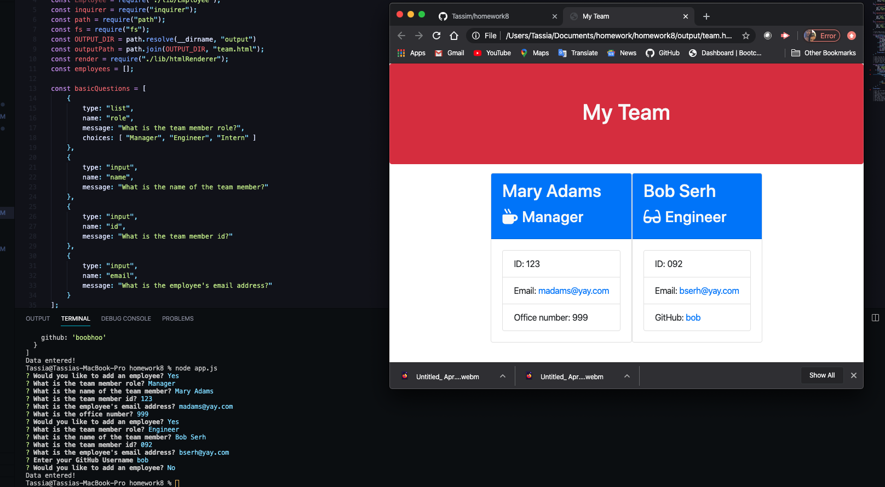

# Template Engine - Employee Summary

This Node CLI that takes in information about employees and generates an HTML webpage that displays summaries for each person.

The software engineering team generator is a command line application. The application prompt the user for information about the team manager and then information about the team members. The user can input any number of team members, and they may be a mix of engineers and interns. 

## User story

As a manager I want to generate a webpage that displays my team's basic info so that I have quick access to emails and GitHub profiles

## Description

* Install the [Inquirer npm package](https://github.com/SBoudrias/Inquirer.js/) to prompt the email, id, and specific information based on their role with the company. For instance, an intern may provide their school, whereas an engineer may provide their GitHub username.

The dependencies are, [jest](https://jestjs.io/) for running the provided tests, and [inquirer](https://www.npmjs.com/package/inquirer) for collecting input from the user.

* User can use the CLI to generate an HTML page that displays information about their team, such as:

  * name
  * id
  * email
  * officeNumber (only managers)
  * github (only engineers)
  * school (only Interns)

![Link to app] (https://tassim.github.io/homework8/)
